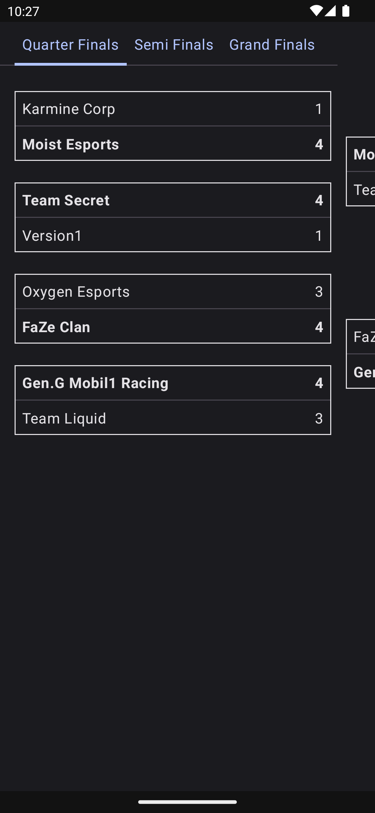
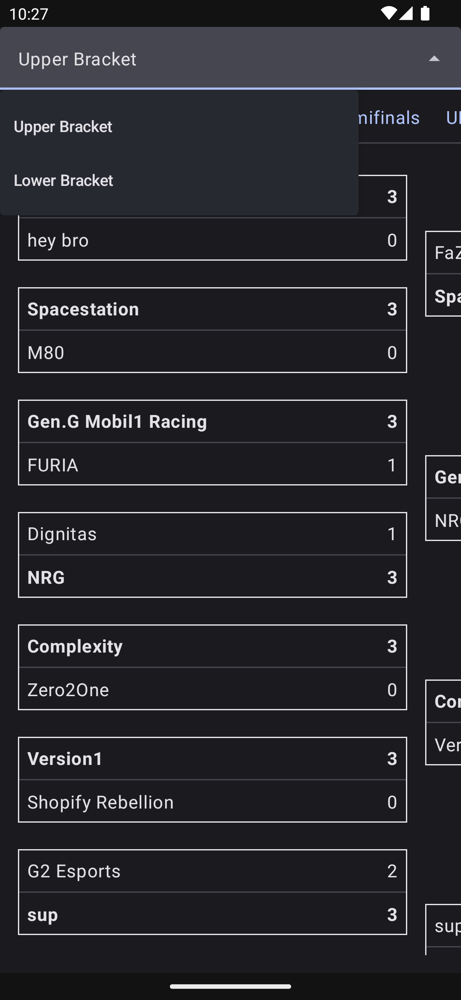

# Status

At the moment, this project is in active development and as such should not be treated as a stable library dependency. To monitor the progress, please refer to the open [Issues](https://github.com/AdamMc331/ComposeTournamentBracket/issues) and [Milestones](https://github.com/AdamMc331/ComposeTournamentBracket/milestones)

# Compose Tournament Bracket

This is a library used to render a tournament bracket with Jetpack Compose.

## Sample

A `SingleEliminationBracket` can be used to demonstrate a series of elimination events resulting in a single winning team.

<details>

<summary>Single Elimination Bracket</summary>



</details>

A `MultiEliminationBracket` is used for double elimination brackets, where a team has multiple lives in a tournament, and we want to see each bracket area by itself.

<details>

<summary>Multi Elimination Bracket</summary>



</details>

## Displaymodel Classes

To create your bracket, there are a few [display model entities](library/src/main/java/com/adammcneilly/tournament/bracket/displaymodels) that must be instantiated to render your bracket.

For example, start by defining a single [match](library/src/main/java/com/adammcneilly/tournament/bracket/displaymodels/BracketMatchDisplayModel.kt):

```kotlin
val match = BracketMatchDisplayModel(
    topTeam = BracketTeamDisplayModel(
        name = "Top Team",
        isWinner = true,
        score = "100",
    ),
    bottomTeam = BracketTeamDisplayModel(
        name = "Bottom Team",
        isWinner = false,
        score = "89",
    ),
)
```

From here, we can begin to define a [round](library/src/main/java/com/adammcneilly/tournament/bracket/displaymodels/BracketRoundDisplayModel.kt):

```kotlin
val semiFinals = listOf(semiFinalMatch1, semiFinalMatch2)
```

Which ultimately allows us to create a [bracket](library/src/main/java/com/adammcneilly/tournament/bracket/displaymodels/BracketDisplayModel.kt):

```kotlin
val bracket = BracketDisplayModel(
    name = "My Tournament Bracket",
    rounds = listOf(round1, quarterFinals, semiFinals, grandFinal),
)
```

## UI Components

There are two public components made available with this library.

### Single Elimination Bracket

With a [SingleEliminationBracket](library/src/main/java/com/adammcneilly/tournament/bracket/ui/SingleEliminationBracket.kt), we can render a traditional bracket format where winning teams move on and losing teams exit. To render this component, we only need a single bracket display model.

```kotlin
Scaffold {
    SingleEliminationBracket(
        bracket = myBracket,
    )
}
```

### Multi Elimination Bracket

A multi elimination bracket, commonly used for double elimination tournaments, represent tournaments where teams can lose more than once before they have to exit the competition. The multi elimination bracket component in this project includes a drop down menu that allows the user to switch between the two brackets (upper and lower, or whatever you define).

In this case, you can simply pass in a list of brackets:

```kotlin
Scaffold {
    MultiEliminationBracket(
        brackets = listOf(upperBracket, lowerBracket),
    )
}
```

## Feature Requests

This project is incredibly minimal, and mostly maintained for a separate personal project. However, if you have any feature requests, feel free to submit an [issue](https://github.com/AdamMc331/ComposeTournamentBracket/issues).

## Download

This library is hosted on MavenCentral. You can include it in your apps by adding the following dependency:

```kotlin
implementation("com.adammcneilly:composetournamentbracket:0.0.1")
```
